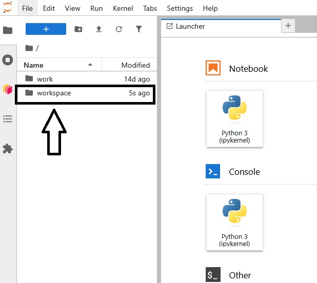
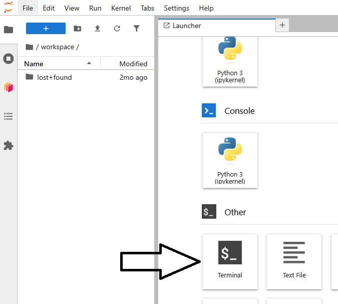

# 👋 Welcome to EOPF Sentinel Zarr Samples Notebooks

## How to run the notebooks

The notebooks can be run on the **EOPF Sentinel Zarr Samples JupyterHub**.

👉 Connect via: [https://jupyterhub.user.eopf.eodc.eu/hub](https://jupyterhub.user.eopf.eodc.eu/hub)


---

Click **Sign in with CDSE IdP** to proceed.

You will be redirected to the CDSE login page:


---

Please log in using your **CDSE user account**.  
If you do not have one, create one now, it's free!

Once logged in, you will see the following interface:


---

Click **Start My Server** to launch your Jupyter session.

---

## Starting Your Environment

After starting your server, you will be directed to the JupyterHub Launcher.


---

Leave the selection on `Default Image` and start you server!

---

## Cloning the Webinar Repository

Once your environment is running, open the **workspace** folder.
**Remember: only the files stored in this folder will remain after closing JupyterHub!**



---

Open now a Terminal:



---

Finally paste the following command and hit _Enter_ on the keyboard to get the notebooks into your workspace:

```
git clone https://github.com/EOPF-Sample-Service/eopf-sample-notebooks.git
```

---

## Launching the Notebooks

On the left panel, navigate to the following directory:

```
eopf-sample-notebooks/notebooks
```

Open the notebook you prefer and start experimenting!

---
