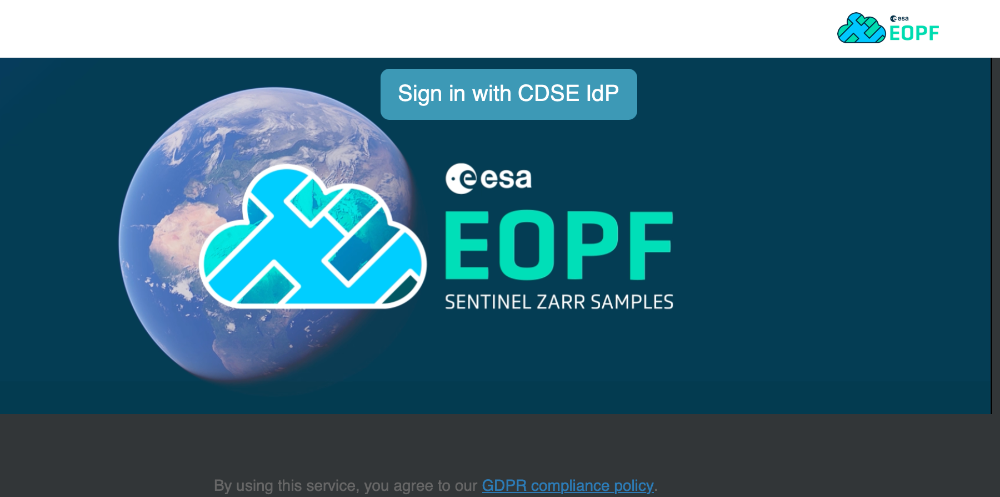
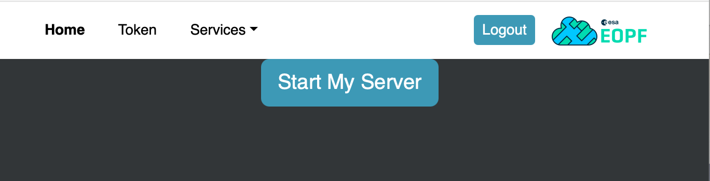
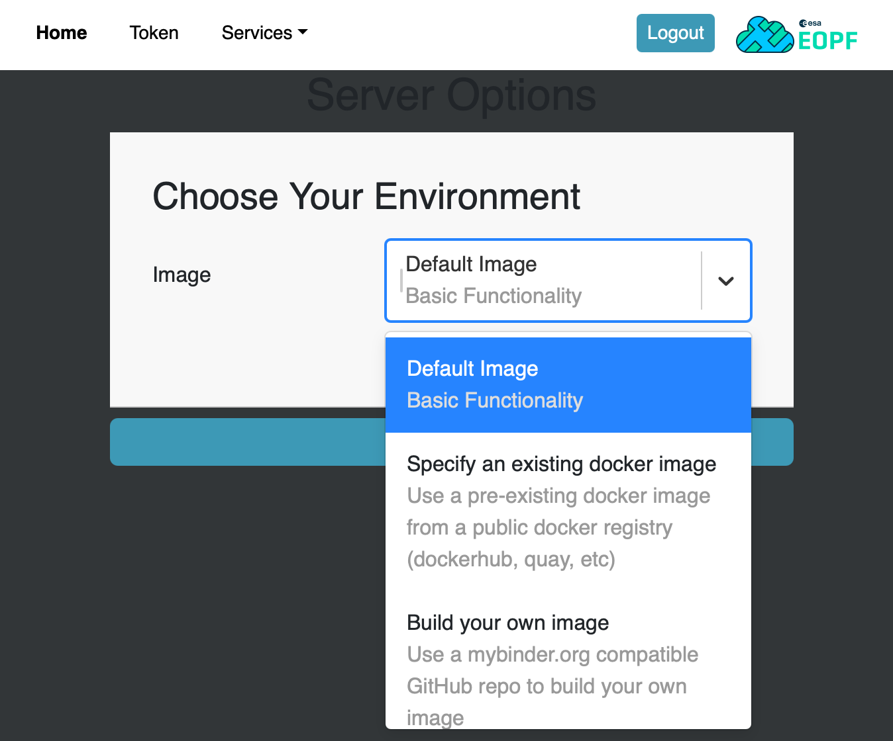
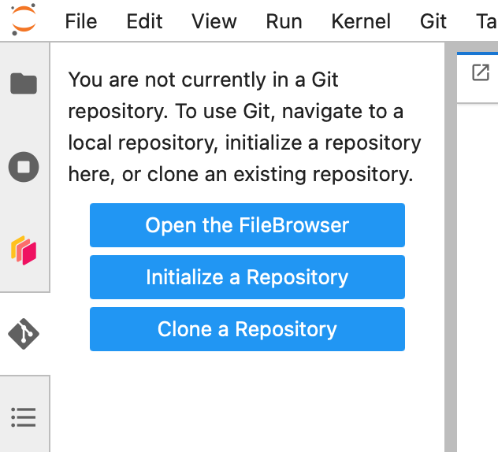

# 👋 Welcome to EOPF Sample Service Notebooks  

## How to run the notebooks

The notebooks can be run on the **EOPF Sample Service JupyterHub**.

👉 Connect via: [https://jupyterhub.user.eopf.eodc.eu/hub](https://jupyterhub.user.eopf.eodc.eu/hub)



Click **Sign in with CDSE IdP** to proceed.

You will be redirected to the CDSE login page:


Please log in using your **CDSE user account**.  
If you do not have one, refer to the **first webinar instructions** on how to create an account for CDSE services.

Once logged in, you will see the following interface:



Click **Start My Server** to launch your Jupyter session.

---

## Starting Your Environment

After starting your server, you will be directed to the JupyterHub Launcher.



Leave the selection on `Default Image` and start you server!

---

## Cloning the Webinar Repository

Once your environment is running, click on the **Git icon** in the left sidebar.



Choose **Clone a Repository**, then paste the following URL and click `Clone` to get the notebooks into your workspace:

```
https://github.com/EOPF-Sample-Service/eopf-sample-notebooks.git
```

---

## Launching the Notebooks

On the left panel, navigate to the following directory:

```
eopf-sample-notebooks/notebooks
```

Open the notebook you prefer and start experimenting!

---

